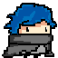
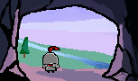



 
Project Name: 	MonstaSlaya
  

Course:		XBGT2054 Game Programming

Name: 		Lim Hong Yu

Student ID: 		0130919

  

**Introduction**

Hi, my name is Hong Yu. This is a game call MonstaSlaya that I made for Game Programming Assignment 3. MonstaSlaya is a game with genre of roguelike, player have to defeat all the enemies in the dungeon as fast as they can to win. There are 3 normal levels, 1 boss level.

**Control Scheme**

- WASD / Arrow Key – Movement
- Mouse – Control player facing direction
- Mouse Left Click – Attack (for all characters)
- Mouse Left Click Hold – Bow increase accuracy, damage increase if hold time is 80% (only for archer)
- E / Scroll Mouse – Switch Characters
- Mouse Right Click – Enable character’s skill
- Mouse Right Click Hold – Cast skill at mouse position (only for archer)

  

**Gameplay**

**Levels**

There are 3 normal levels and 1 boss level. Each level contained these enemies

Level 1 (Normal) – Wolf, Troll

Level 2 (Normal) – Wolf, Troll, Mushroom

Level 3 (Normal) – Wolf, Troll, Mushroom

Level 4 (Boss Level) – Kam the Golem

For each normal level, there will have wave of monsters spawned at random positions once the player steps into the room. The player needs to clear from level 1 to boss level to win the game.

**Health System**

The player will start with 7 health and 6 shields. When player was damaged, the damage will deal to the shield first. If there is no shield left, the damage will deal to health. If the shield only takes part of the damage and become 0, the overflow damage will deal to health. 

**Switch Character**

The player able to switch character in any time they wanted. There are 3 characters in the game, knight, archer and assassin. Knight and assassin are melee type while archer is range type. All character’s attack direction can be controlled by mouse positioning. The switching sequence is Knight -> Archer -> Assassin -> Knight.

                                                               &nbsp;&nbsp;                 

&nbsp;**Knight        &nbsp; &nbsp;&nbsp; &nbsp;&nbsp;    Archer    &nbsp;&nbsp;&nbsp;&nbsp;&nbsp; &nbsp;         Assassin**

**Player Status**

|

Paralyzed

|

When player hit by some attack from monster, player will get paralyzed and can’t do anything such as attack, moving or any other moves for 5 seconds.
|
| :-: | :- |

**Character Skill**

|Skill|Descriptions|
| :-: | :-: |
|

Knighty Shield

|

Cooldown: 15s

After mouse right click, a circle shield will spawn around knight and remain for 5 seconds. During the 5 seconds, player able to immune from all damage
|
|

Archery Boom

|

Cooldown: 40s

When holding mouse right click, a targeting area will be appeared. Player can use mouse to determine where to cast the skill and release mouse right click to cast it. A total of 5 arrows will be dropped down and each arrow will deal 10 damage to enemy

|
|

Assassinations

|

Cooldown: 6s

After mouse right click, assassin will rush towards mouse directions. In the middle of rushing, player will immune from all damage.
|

**Enemy Types**

|Enemy|Descriptions|
| :- | :- |
|

Wolf

|

Type: Melee

When the wolf is in attack state, it will rush towards player and perform a slash. If after 4 seconds it still couldn’t chase the player then it will enter rest state.
|
|

Troll

|

Type: Melee

When the troll is in attack state, it will walk towards player and perform a slash. If after 4 seconds it still couldn’t chase the player then it will enter rest state.

|
|

Mushroom

|

Type: Range

When the mushroom is in attack state, it will retreat if player is close to it. If player is far from it, it will shoot a bullet towards player’s position

|
|

Wizard

|

Type: Range

When the wizard is in attack state it will retreat if player is close to it. If player is far from it, it will shoot 4 bouncing bullets towards player’s direction
|

  
**Boss**

|Boss|Descriptions|
| :- | :- |
|

Kam the Golem

|

Type: Melee/Range

Attack Moves: Jump, Rush, Smash, Throw

Special Moves: Rage

Jump

- In Jump Attack, the boss will jump to the air and a warning area will appear. The warning area will go towards player and jump down to deal damage to surrounding if chased player.  After 3 seconds, if boss couldn’t chase player, it will jump down too.

- In Rage mode, the speed of chasing player will be increased.

Rush

- In Rush Attack, the boss will become a rock and roll towards player’s position. The boss will deal damage if player collided with it while in Rush moves. After the Rush ends, the boss will immediately perform Smash moves.

- In Rage mode, the speed of chasing player will be increased.

Smash

- In Smash Attack, the boss will smash the floor and deal damage to surrounding. At the same time 4 bouncing bullets will spawned from smash and shoot towards player’s direction for every smash.

- In Rage mode, the boss will spawn 100 bouncing bullets per smash.

Throw

- In Throw Attack, the boss will throw a rock towards player’s direction. The rock will cause player damaged and enter paralyzed status

- In Rage mode, the number of rock throwing towards player is 3.

Rage Mode

- When boss health is lower than half, the boss will enter rage mode.

- In rage mode, every attack moves of bosses will become stronger.

- Speed and damage will be increased in rage mode

|

  

**Additional**

1. There are different win and lose screen background. Each background is determined on which is their last character after defeat boss / die in the gameplay levels. 

Examples for win bg:

1. There are stopwatch timer to records player clear time after player win or lose, The best time record of wining levels will displayed on Main Menu.

  

**References and Sources**

**Audio**

**BGM**

Menu BGM - https://maou.audio/bgm\_piano39/

Battle BGM - https://freesound.org/people/Sirkoto51/sounds/443128/

Boss Battle BGM - https://freesound.org/people/Sirkoto51/sounds/416632/

Game Over BGM - https://maou.audio/bgm\_piano40/

Win BGM - <https://maou.audio/bgm_piano37/>

**SFX**

Button SFX - <https://maou.audio/se_system49/>

**Knight SFX**

Open shield SFX - <https://maou.audio/se_system03/>

Attack SFX - https://freesound.org/people/Merrick079/sounds/568169/

Attack 2 SFX -  https://freesound.org/people/32cheeseman32/sounds/180828/

Attack 3 SFX - <https://freesound.org/people/wesleyextreme_gamer/sounds/574821/>

**Archer SFX**

shoot skill SFX - https://maou.audio/se\_battle03/

drop skill SFX - <https://maou.audio/se_battle_explosion07/>

Attack SFX - <https://freesound.org/people/Lydmakeren/sounds/511489/> 

Attack 2 SFX - <https://freesound.org/people/jzdnvdoosj/sounds/626262/>

**Assassin SFX**

Assassin rolling SFX - <https://freesound.org/people/MusicLegends/sounds/344310/>

**Golem SFX**

Smash - https://freesound.org/people/studiomandragore/sounds/401628/

Jump Down - https://freesound.org/people/Isaac200000/sounds/181377/

Jump Up - https://freesound.org/people/bevibeldesign/sounds/366091/

Rage - https://freesound.org/people/icyjim/sounds/476083/

**Art Assets**

Enemies and Boss - <https://superdark.itch.io/enchanted-forest-characters>

**Characters Assets**

Characters Art Reference: Soul Knight
